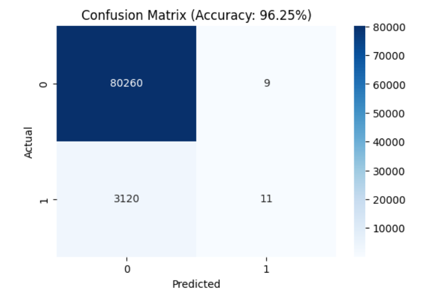

📍 Silent Places Location Detection
📖 Overview
This project detects silent places based on GPS coordinates stored in a CSV file (location.csv).
Silent places are identified as locations where no movement or activity has been recorded for a certain period, based on the latestTimestamp.

It also ensures the CSV is cleaned for hidden or unexpected characters in column names to avoid key errors.

📂 Dataset Format
The location.csv file should contain the following columns:

Column Name	Description
id	Unique identifier for the location/device
latitude	Latitude coordinate (float)
longitude	Longitude coordinate (float)
radius	Location radius in meters
latestTimestamp	Last recorded time for that location (UNIX timestamp or ISO date)

Example:

csv
Copy
Edit
id,latitude,longitude,radius,latestTimestamp
1,22.5726,88.3639,50,2025-08-09 14:35:00
2,22.5740,88.3650,30,2025-08-05 10:15:00
3,22.5800,88.3700,40,2025-08-01 08:00:00
⚙️ How It Works
Load CSV
Reads location.csv into a pandas DataFrame.

Clean Column Names
Removes any hidden characters or spaces from headers.

Time Filtering
Filters locations that have not been updated in N days (configurable).

Extract Coordinates
Saves the latitude and longitude of silent places to a separate DataFrame.

Output

Prints silent places coordinates in the console.

Saves them to silent_places.csv.

📜 Full Code
python
Copy
Edit
import pandas as pd
from datetime import datetime, timedelta

# ==== CONFIG ====
CSV_FILE = "location.csv"   # Input CSV
OUTPUT_FILE = "silent_places.csv"
DAYS_INACTIVE = 3  # Number of days without update to consider silent
# =================

# Step 1: Read CSV
df = pd.read_csv(CSV_FILE)

# Step 2: Clean column names (remove hidden characters & spaces)
df.columns = df.columns.str.strip().str.replace('\ufeff', '', regex=True)

# Debug: Check column names
print("Cleaned Columns:", list(df.columns))

# Step 3: Ensure 'latestTimestamp' is in datetime format
df['latestTimestamp'] = pd.to_datetime(df['latestTimestamp'], errors='coerce')

# Step 4: Define cutoff time
cutoff_time = datetime.now() - timedelta(days=DAYS_INACTIVE)

# Step 5: Filter silent places
silent_places = df[df['latestTimestamp'] < cutoff_time][['latitude', 'longitude']]

# Step 6: Output results
if silent_places.empty:
    print("No silent places found!")
else:
    print("Silent places coordinates saved!")
    print(silent_places)
    silent_places.to_csv(OUTPUT_FILE, index=False)
🛠 Usage
Place your location.csv file in the project folder.

Adjust DAYS_INACTIVE in the code to your preference.

Run the script:

bash
Copy
Edit
python detect_silent_places.py
The results will appear in:

Console Output

silent_places.csv (if any found)

📌 Example Output

Console:

css
Copy
Edit
Cleaned Columns: ['id', 'latitude', 'longitude', 'radius', 'latestTimestamp']
Silent places coordinates saved!
   latitude  longitude
1  22.5740   88.3650
2  22.5800   88.3700
silent_places.csv:

csv
Copy
Edit
latitude,longitude
Author
Sagnik Patra
22.5740,88.3650
22.5800,88.3700
🧠 Notes
